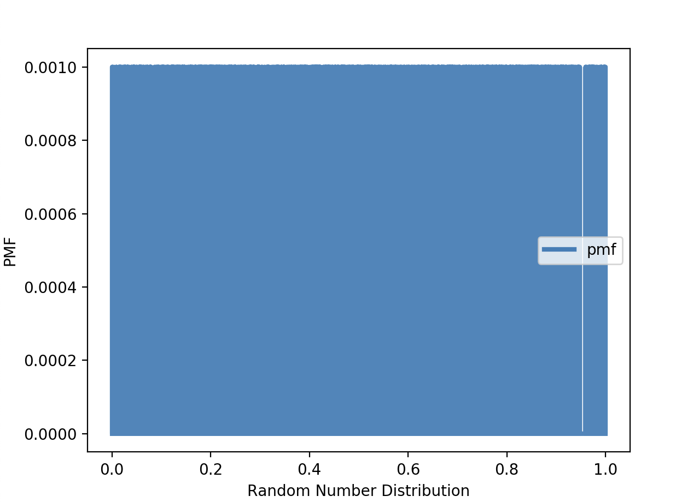
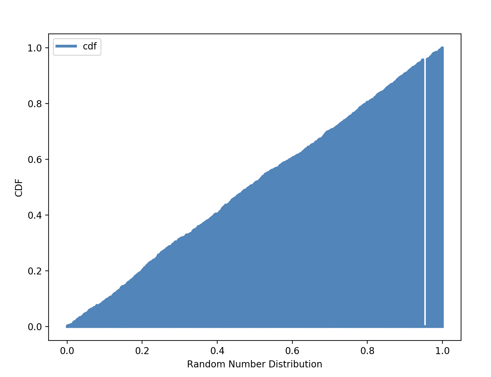

[Think Stats Chapter 4 Exercise 2](http://greenteapress.com/thinkstats2/html/thinkstats2005.html#toc41) (a random distribution)

# My python file
```
import random
import thinkstats2
import thinkplot

rand_list = []
for i in range(1000):
    rand_list.append(random.random())

pmf = thinkstats2.Pmf(rand_list, label='pmf')
cdf = thinkstats2.Cdf(pmf, label='cdf')

thinkplot.PrePlot(1)
thinkplot.Pmfs([pmf])
thinkplot.Show(xlabel='Random Number Distribution', ylabel='PMF')

thinkplot.PrePlot(1)
thinkplot.Pmfs([cdf])
thinkplot.Show(xlabel='Random Number Distribution', ylabel='CDF')
```

## The results:

The distribution of random numbers is uniform.



